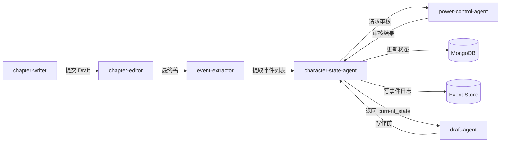

# 角色状态机（V3）

> **所属系统**: novel-factory V3  
> **负责 Agent**: character-state-agent  
> **版本**: 3.0  
> **最后更新**: 2026-05-18  

---

## 目录

1. [设计目标](#1-设计目标)
2. [角色数据结构（MongoDB Schema）](#2-角色数据结构mongodb-schema)
3. [角色状态量化指标](#3-角色状态量化指标)
4. [relationship_graph（关系图）](#4-relationship_graph关系图)
5. [状态变化规则](#5-状态变化规则)
6. [character-state-agent 职责](#6-character-state-agent-职责)
7. [Draft 写作前强制读取规则](#7-draft-写作前强制读取规则)
8. [状态变化事件日志（事件溯源）](#8-状态变化事件日志事件溯源)
9. [Python 示例代码](#9-python-示例代码)
10. [演化流程图](#10-演化流程图)

---

## 1. 设计目标

V2 角色数据只有静态快照（`name` / `personality` / `traits`），角色在整个故事中如同「石头」般不变，导致：

- 角色行为缺乏一致性演化
- 关系变化无迹可寻
- Agent 写作时无法感知角色当前状态

V3 **角色状态机** 的核心目标：

| 目标 | 说明 |
|------|------|
| **动态演化** | 角色随剧情推进发生可量化的状态变化 |
| **因果一致** | 所有状态变化必须绑定具体剧情事件 |
| **关系网络** | 角色间双向关系可追踪、可溯源 |
| **写作约束** | Draft Agent 写作前必须读取当前状态，确保行为一致 |
| **事件溯源** | 所有状态变更记录为不可变事件日志 |

---

## 2. 角色数据结构（MongoDB Schema）

每个角色在 MongoDB 中存储为一份 document，完整 schema 如下：

```json
{
  "_id": ObjectId,
  "character_id": "uuid-string",
  "name": "林若溪",

  /* ========== 不可变基础 ========== */
  "base_personality": {
    "mbti": "INFJ",
    "core_traits": ["温柔", "坚韧", "多疑"],
    "moral_alignment": "中立善良",
    "speaking_style": "含蓄婉转，喜用比喻",
    "decision_bias": "风险规避型"
  },

  /* ========== 可变当前状态 ========== */
  "current_state": {
    "emotion": {
      "primary": "悲伤",
      "secondary": "愤怒",
      "intensity": 0.75,
      "description": "发现背叛后心灰意冷，但仍有复仇冲动"
    },
    "trust": 35,
    "fatigue": 62,
    "wealth": 5000,
    "combat_level": 47,
    "influence": 20,
    "loyalty": 55,
    "sanity": 80,
    "motivation": 70
  },

  /* ========== 关系图谱 ========== */
  "relationship_graph": {
    "character_A_id": {
      "relationship": "暗恋",
      "trust_score": 85,
      "description": "暗中守护多年，从未表白",
      "history": [
        {
          "chapter": 3,
          "event": "雨中送伞",
          "delta": {"trust_score": +10, "relationship": "陌生→朋友"},
          "note": "第一次近距离接触"
        },
        {
          "chapter": 7,
          "event": "替她挡下暗器",
          "delta": {"trust_score": +20, "relationship": "朋友→暗恋"},
          "note": "舍身相救，感情升温"
        }
      ]
    },
    "character_B_id": {
      "relationship": "敌对",
      "trust_score": 5,
      "description": "商场上多次交锋，彼此视为眼中钉",
      "history": [
        {
          "chapter": 2,
          "event": "竞标冲突",
          "delta": {"trust_score": -15, "relationship": "中立→竞争"},
          "note": "第一次商业冲突"
        },
        {
          "chapter": 10,
          "event": "商业间谍事件",
          "delta": {"trust_score": -30, "relationship": "竞争→敌对"},
          "note": "对方安插卧底，彻底决裂"
        }
      ]
    }
  },

  /* ========== 记忆系统 ========== */
  "recent_memory": [
    {
      "chapter": 12,
      "event": "发现闺蜜与对手暗中会面",
      "impact": "trust -20, emotion → 悲伤",
      "keywords": ["背叛", "怀疑"]
    },
    {
      "chapter": 11,
      "event": "获得神秘老者的武功秘籍",
      "impact": "combat_level +5, motivation +10",
      "keywords": ["奇遇", "成长"]
    },
    {
      "chapter": 10,
      "event": "公司账目被冻结",
      "impact": "wealth -50000, fatigue +15",
      "keywords": ["危机", "经济"]
    },
    {
      "chapter": 9,
      "event": "帮助流浪儿童找到家人",
      "impact": "loyalty +5, influence +3",
      "keywords": ["善举", "声望"]
    },
    {
      "chapter": 8,
      "event": "深夜与神秘人交手受伤",
      "impact": "combat_level +2, fatigue +20, sanity -5",
      "keywords": ["战斗", "受伤"]
    }
  ],

  /* ========== 长期目标 ========== */
  "long_term_goal": {
    "original": "查明父母死因，为家族洗清冤屈",
    "current": "夺取对手公司控制权，逼出幕后黑手",
    "evolution_history": [
      {
        "chapter": 1,
        "from": null,
        "to": "查明父母死因，为家族洗清冤屈",
        "trigger": "主角开局设定"
      },
      {
        "chapter": 5,
        "from": "查明父母死因",
        "to": "夺取对手公司控制权，逼出幕后黑手",
        "trigger": "发现对手公司可能与父母之死有关"
      }
    ],
    "progress": 0.35
  },

  /* ========== 隐藏属性 ========== */
  "hidden_flags": {
    "dark_tendency": 25,
    "redemption_clues": [],
    "secret_identity": null,
    "hidden_skills": ["古武传承·未觉醒"],
    "weaknesses": ["怕火", "幽闭恐惧症"],
    "plot_anchors": ["与市长有隐秘交易", "真实身世待揭晓"]
  },

  /* ========== 元数据 ========== */
  "metadata": {
    "created_at": ISODate("2026-01-15T08:00:00Z"),
    "last_updated": ISODate("2026-05-18T03:50:00Z"),
    "last_updated_by": "character-state-agent",
    "version": 47,
    "total_state_changes": 156
  }
}
```

---

## 3. 角色状态量化指标

### 3.1 核心指标一览

| 字段 | 类型 | 范围 | 初始值 | 说明 |
|------|------|------|--------|------|
| `emotion.primary` | string | 情绪标签集 | 取决于开场 | 当前主导情绪 |
| `emotion.secondary` | string | 情绪标签集 | null | 次要情绪 |
| `emotion.intensity` | float | 0.0 ~ 1.0 | 0.5 | 情绪强度 |
| `trust` | int | 0 ~ 100 | 50 | 对他人的普遍信任度 |
| `fatigue` | int | 0 ~ 100 | 0 | 疲劳值，≥80 时可能做出非理性决策 |
| `wealth` | int | 0 ~ ∞ | 按设定 | 财富值，影响行为选择范围 |
| `combat_level` | int | 0 ~ 9999 | 按设定 | 战力等级 |
| `influence` | int | 0 ~ 100 | 0 | 社会影响力/声望 |
| `loyalty` | int | 0 ~ 100 | 50 | 对主线阵营/同伴的忠诚度 |
| `sanity` | int | 0 ~ 100 | 100 | 理智值，≤30 进入疯狂状态 |
| `motivation` | int | 0 ~ 100 | 70 | 行动驱动力，≤20 可能摆烂/退场 |

### 3.2 情绪标签集（示例）

```
喜悦, 悲伤, 愤怒, 恐惧, 惊讶, 厌恶, 羞愧, 嫉妒, 希望, 绝望,
焦虑, 平静, 兴奋, 厌倦, 感激, 仇恨, 困惑, 轻蔑, 爱慕, 思念
```

### 3.3 状态阈值触发规则

| 条件 | 触发效果 |
|------|----------|
| `fatigue ≥ 80` | 决策失误率 +30%，可能主动休息或放弃任务 |
| `sanity ≤ 30` | 进入「疯狂」状态，行为不可预测 |
| `sanity ≤ 10` | 黑化倾向 +50，可能叛变 |
| `motivation ≤ 20` | 角色暂时退场/消极避世 |
| `trust ≤ 15` | 拒绝任何合作，可能主动敌对 |
| `combat_level 跨百位` | 触发战力等级突破事件（需 power-control 审核） |
| `loyalty ≥ 90` | 解锁「誓死追随」行为模式 |
| `loyalty ≤ 20` | 高叛变风险 |

---

## 4. relationship_graph（关系图）

### 4.1 数据结构

关系图存储在角色 document 内的 `relationship_graph` 字段，是一个以对方 `character_id` 为 key 的 map。

```json
{
  "relationship": "友好 | 敌对 | 暗恋 | 仇恨 | 师徒 | 合作 | 陌生",
  "trust_score": 0..100,
  "description": "人类可读的关系描述",
  "history": [
    {
      "chapter": 3,
      "event": "事件简述",
      "delta": {"trust_score": +/-N, "relationship": "旧关系→新关系"},
      "note": "详细说明"
    }
  ]
}
```

### 4.2 关系类型枚举

| 关系类型 | 典型 trust_score 范围 | 双向对称性 |
|----------|----------------------|-----------|
| 陌生 | 40~60 | 对称 |
| 朋友 | 61~85 | 近似对称 |
| 好友/挚友 | 86~100 | 近似对称 |
| 暗恋 | 70~100 | 不对称 |
| 恋爱 | 80~100 | 对称（需双方确认） |
| 敌对 | 0~20 | 对称 |
| 仇恨 | 0~10 | 对称 |
| 师徒 | 60~95 | 不对称 |
| 合作 | 50~80 | 近似对称 |
| 利用 | 20~50 | 不对称 |
| 恐惧 | 10~40 | 不对称 |

### 4.3 关系变化规则

1. **双向一致性**：A→B 的关系变化应同步影响 B→A（除非有明确原因不对称）
2. **历史不可删改**：history 数组只 append，不修改/删除已有记录
3. **大事件必须记录**：trust_score 变化绝对值 ≥ 20 的事件必须记入 history
4. **关系类型跃迁**：关系类型变化（如「友好→敌对」）必须伴随一个关键剧情事件

---

## 5. 状态变化规则

### 5.1 核心原则

| 规则 | 描述 |
|------|------|
| **因果绑定** | 每个状态变化必须关联一个具体的剧情事件（event_id 或 chapter + 简述） |
| **渐变优先** | 单次变化幅度原则上 ≤ 20（战力突破等特殊情况例外） |
| **跨百审核** | 当 combat_level 跨越新百位（如 99→100）时，必须经 power-control agent 审核 |
| **历史追溯** | 所有变化必须能通过事件溯源回溯到原始触发事件 |
| **非负/非越界** | 所有数值指标不得超出定义范围，超出部分截断并告警 |

### 5.2 每章结束后的更新流程

```
每章 Draft 完成
       │
       ▼
character-state-agent 读取本章所有事件
       │
       ▼
分析每个事件对相关角色的影响
       │
       ▼
计算状态变化量（delta）
       │
       ▼
检查 combat_level 跨百 → 调用 power-control 审核
       │
       ▼
更新 current_state
       │
       ▼
更新 relationship_graph（如果需要）
       │
       ▼
更新 recent_memory（追加新事件，移除最旧事件）
       │
       ▼
检查 hidden_flags 触发条件
       │
       ▼
写入状态变化事件日志
       │
       ▼
更新 metadata.version++
```

### 5.3 战力提升规则

```
combat_level 变化必须满足以下之一：
  ┌─ 经历战斗胜利（+1~+5）
  ├─ 获得功法/秘籍（+5~+20）
  ├─ 名师指点（+3~+10）
  ├─ 实战历练（+1~+3，每章限一次）
  └─ 特殊奇遇（+10~+50，需 power-control 审核）

  ⚠ 跨百审核（100, 200, 300, ...）:
     - 不允许跳过审核直接写入
     - power-control agent 需评估：
       1. 战力增长是否符合剧情逻辑
       2. 是否破坏当前战力量级平衡
       3. 是否有对应等级的战斗场景匹配
```

### 5.4 情感变化规则

```
emotion 变化规则：
  1. 受同类事件影响时优先强化当前情绪（intensity +0.1~0.2）
  2. 受对立事件影响时可能切换情绪
  3. 同章节内情绪最多切换 2 次
  4. intensity 自然衰减：每章 -0.05（无新触发事件时）
  5. 重大创伤事件可能导致 emotion 锁定（3~5 章内无法切换）
```

### 5.5 hidden_flags 演化

```
hidden_flags 的演化是剧情暗线的重要组成部分：

- dark_tendency: 每次遭遇不公/背叛 +5~15；每次获得温暖/救赎 -3~10
  → 当 ≥ 80 时触发「黑化支线」
  → 当 ≥ 95 时强制黑化，写入主线

- redemption_clues: 反派角色获得洗白线索时追加
  → 累计 ≥ 3 条时解锁「洗白支线」

- secret_identity: 由 plot-agent 在特定章节解锁
  → 解锁后影响所有关系方的 relationship_graph

- weaknesses: 在角色成长过程中可以被克服
  → 克服后移出 weaknesses 并记入 recent_memory
```

---

## 6. character-state-agent 职责

### 6.1 Agent 定位

`character-state-agent` 是 novel-factory V3 中的**角色状态管理专家**，负责所有角色状态的读取、更新、审核与版本追踪。

### 6.2 核心职责

| 职责 | 说明 |
|------|------|
| **状态读取** | 为 Draft Agent 提供指定角色的当前完整状态快照 |
| **状态更新** | 每章结束后，根据剧情事件批量更新涉及角色的状态 |
| **关系维护** | 更新 relationship_graph，确保双向关系一致性 |
| **记忆管理** | 管理 recent_memory，维护最近 5 条关键事件 |
| **阈值监控** | 监控各项指标是否触发阈值规则 |
| **战力审核** | combat_level 跨百时发起 power-control 审核流程 |
| **日志写入** | 将每次状态变化写入事件溯源日志 |
| **版本追踪** | 维护每个角色 document 的 version 字段 |

### 6.3 输入 / 输出

```
输入:
  - 本章剧情事件列表（来自 chapter-events）
  - 受事件影响的角色 ID 列表
  - power-control 审核结果（可选）

输出:
  - 更新后的角色 Document（写入 MongoDB）
  - 状态变化事件日志（写入 event-store）
  - 状态变化摘要（供 summarizer-agent 使用）
```

### 6.4 与其他 Agent 的协作



---

## 7. Draft 写作前强制读取规则

### 7.1 规则定义

所有 Draft Agent（包括 `chapter-writer`、`dialogue-writer`、`action-scene-writer` 等）在**开始写作**前，必须调用 `character-state-agent` 获取目标角色的 `current_state`。

### 7.2 读取内容

```python
required_state_snapshot = {
    "character_id": "...",
    "name": "...",
    "current_state": {
        "emotion": ...,
        "fatigue": ...,
        "sanity": ...,
        "motivation": ...
    },
    "relationship_graph": {
        target_character_id: {
            "relationship": ...,
            "trust_score": ...
        }
    },
    "recent_memory": [...],  # 最近 5 条
    "long_term_goal": ...
}
```

### 7.3 强制校验

Draft Agent 的输出中，角色行为必须与 `current_state` 一致。系统在 draft 提交后执行**状态一致性检查**：

```
一致性检查清单:
  [ ] 角色对话语气是否匹配 emotion？
  [ ] 角色决策是否受 trust / fatigue / motivation 影响？
  [ ] 关系互动是否匹配 relationship_graph？
  [ ] 战力表现是否在 combat_level 合理范围内？
```

一致性检查失败的 Draft 将被标记为 `inconsistent` 退回修订。

### 7.4 技术实现

```python
# 伪代码：Draft Agent 强制读取接口
from character_state_agent import CharacterStateAgent

state_agent = CharacterStateAgent()

def before_write_draft(chapter_number, involved_characters):
    """Draft 写作前必须调用的前置函数"""
    states = {}
    for char_id in involved_characters:
        state = state_agent.get_current_state(char_id)
        states[char_id] = state
        # 将状态注入 writing context
        inject_to_context(char_id, state)
    return states
```

---

## 8. 状态变化事件日志（事件溯源）

### 8.1 事件格式

每个状态变化记录为不可变事件，存储在独立的 Event Store 中（MongoDB 或 EventStoreDB）：

```json
{
  "_id": ObjectId,
  "event_id": "evt-20260518-001",
  "event_type": "character_state_change",
  "timestamp": ISODate("2026-05-18T03:50:00.000Z"),

  "character_id": "uuid-char-A",
  "chapter": 12,

  "trigger_event": {
    "type": "战斗",
    "summary": "林若溪在密林遭遇暗杀，反杀刺客后获得线索",
    "chapter_event_id": "chap-12-evt-03"
  },

  "changes": {
    "current_state": {
      "combat_level": {"old": 45, "new": 47, "delta": +2},
      "fatigue": {"old": 40, "new": 55, "delta": +15},
      "emotion": {
        "old": {"primary": "平静", "intensity": 0.5},
        "new": {"primary": "愤怒", "intensity": 0.7}
      }
    },
    "relationship_graph": {
      "character_B_id": {
        "trust_score": {"old": 20, "new": 5, "delta": -15},
        "relationship": {"old": "竞争", "new": "敌对"}
      }
    }
  },

  "power_control_approved": false,
  "agent": "character-state-agent",
  "metadata": {
    "character_version_before": 46,
    "character_version_after": 47
  }
}
```

### 8.2 事件类型枚举

| event_type | 说明 |
|------------|------|
| `character_state_change` | 常规状态更新（每章结束） |
| `relationship_break` | 关系决裂（trust_score ≤ 10） |
| `combat_breakthrough` | 战力突破（跨百） |
| `emotion_flip` | 情绪翻转（intensity ≥ 0.8 时突变） |
| `hidden_flag_triggered` | 隐藏属性触发 |
| `goal_evolution` | 长期目标演变 |
| `blackening_event` | 黑化事件 |
| `redemption_event` | 洗白事件 |

### 8.3 事件查询接口

```python
# 查询某个角色的完整变化历史
events = event_store.query(
    character_id="uuid-char-A",
    event_type="character_state_change",
    from_chapter=1,
    to_chapter=12
)

# 查询特定指标的变化趋势
combat_trend = event_store.query(
    character_id="uuid-char-A",
    event_type="character_state_change",
    fields=["combat_level"]
)
```

### 8.4 回滚恢复

基于事件溯源，可以将角色恢复到任意历史章节的状态：

```python
def rollback_character(character_id, target_chapter):
    """将角色回滚到指定章节结束时的状态"""
    base_state = get_initial_character(character_id)
    events = event_store.query(
        character_id=character_id,
        from_chapter=1,
        to_chapter=target_chapter
    )
    for event in events:
        base_state = apply_event(base_state, event)
    return base_state
```

---

## 9. Python 示例代码

### 9.1 角色数据模型

```python
"""character_state_machine.py — novel-factory V3 角色状态机核心模型"""

from __future__ import annotations
from dataclasses import dataclass, field
from datetime import datetime
from enum import Enum
from typing import Any, Dict, List, Optional
import uuid


class Emotion(str, Enum):
    JOY = "喜悦"
    SADNESS = "悲伤"
    ANGER = "愤怒"
    FEAR = "恐惧"
    SURPRISE = "惊讶"
    DISGUST = "厌恶"
    SHAME = "羞愧"
    JEALOUSY = "嫉妒"
    HOPE = "希望"
    DESPAIR = "绝望"
    ANXIETY = "焦虑"
    CALM = "平静"
    EXCITEMENT = "兴奋"
    BOREDOM = "厌倦"
    GRATITUDE = "感激"
    HATRED = "仇恨"
    CONFUSION = "困惑"
    CONTEMPT = "轻蔑"
    LOVE = "爱慕"
    NOSTALGIA = "思念"


class Relationship(str, Enum):
    STRANGER = "陌生"
    FRIEND = "朋友"
    CLOSE_FRIEND = "好友"
    SECRET_CRUSH = "暗恋"
    LOVE = "恋爱"
    HOSTILE = "敌对"
    HATRED = "仇恨"
    MENTOR = "师徒"
    COOPERATION = "合作"
    EXPLOITING = "利用"
    FEAR = "恐惧"


@dataclass
class EmotionState:
    primary: Emotion
    secondary: Optional[Emotion] = None
    intensity: float = 0.5
    description: str = ""

    def validate(self):
        if not 0.0 <= self.intensity <= 1.0:
            raise ValueError(f"Emotion intensity must be in [0, 1], got {self.intensity}")


@dataclass
class CurrentState:
    emotion: EmotionState
    trust: int = 50
    fatigue: int = 0
    wealth: int = 0
    combat_level: int = 1
    influence: int = 0
    loyalty: int = 50
    sanity: int = 100
    motivation: int = 70

    def validate(self):
        for field_name, (value, lo, hi) in {
            "trust": (self.trust, 0, 100),
            "fatigue": (self.fatigue, 0, 100),
            "influence": (self.influence, 0, 100),
            "loyalty": (self.loyalty, 0, 100),
            "sanity": (self.sanity, 0, 100),
            "motivation": (self.motivation, 0, 100),
        }.items():
            if not lo <= value <= hi:
                raise ValueError(
                    f"{field_name} must be in [{lo}, {hi}], got {value}"
                )
        self.emotion.validate()


@dataclass
class RelationshipHistoryEntry:
    chapter: int
    event: str
    delta: Dict[str, Any]
    note: str = ""


@dataclass
class RelationshipEntry:
    relationship: Relationship
    trust_score: int = 50
    description: str = ""
    history: List[RelationshipHistoryEntry] = field(default_factory=list)

    def validate(self):
        if not 0 <= self.trust_score <= 100:
            raise ValueError(f"trust_score must be in [0, 100], got {self.trust_score}")


@dataclass
class RecentMemoryEntry:
    chapter: int
    event: str
    impact: str
    keywords: List[str] = field(default_factory=list)


@dataclass
class GoalEvolution:
    chapter: int
    from_goal: Optional[str]
    to_goal: str
    trigger: str


@dataclass
class LongTermGoal:
    original: str
    current: str
    evolution_history: List[GoalEvolution] = field(default_factory=list)
    progress: float = 0.0

    def validate(self):
        if not 0.0 <= self.progress <= 1.0:
            raise ValueError(f"Goal progress must be in [0, 1], got {self.progress}")


@dataclass
class HiddenFlags:
    dark_tendency: int = 0
    redemption_clues: List[str] = field(default_factory=list)
    secret_identity: Optional[str] = None
    hidden_skills: List[str] = field(default_factory=list)
    weaknesses: List[str] = field(default_factory=list)
    plot_anchors: List[str] = field(default_factory=list)

    def validate(self):
        if not 0 <= self.dark_tendency <= 100:
            raise ValueError(
                f"dark_tendency must be in [0, 100], got {self.dark_tendency}"
            )


@dataclass
class CharacterMetadata:
    created_at: datetime = field(default_factory=datetime.utcnow)
    last_updated: datetime = field(default_factory=datetime.utcnow)
    last_updated_by: str = "character-state-agent"
    version: int = 1
    total_state_changes: int = 0


@dataclass
class CharacterDocument:
    character_id: str = field(default_factory=lambda: str(uuid.uuid4()))
    name: str = ""

    base_personality: Dict[str, Any] = field(default_factory=dict)
    current_state: CurrentState = field(default_factory=CurrentState)
    relationship_graph: Dict[str, RelationshipEntry] = field(default_factory=dict)
    recent_memory: List[RecentMemoryEntry] = field(default_factory=list)
    long_term_goal: LongTermGoal = field(default_factory=LongTermGoal)
    hidden_flags: HiddenFlags = field(default_factory=HiddenFlags)
    metadata: CharacterMetadata = field(default_factory=CharacterMetadata)

    def to_dict(self) -> Dict[str, Any]:
        """序列化为 MongoDB document"""
        # 实际项目中用 dataclasses.asdict + 自定义序列化
        raise NotImplementedError

    def validate(self):
        self.current_state.validate()
        self.hidden_flags.validate()
        self.long_term_goal.validate()
        for rel in self.relationship_graph.values():
            rel.validate()
        if len(self.recent_memory) > 5:
            raise ValueError("recent_memory cannot exceed 5 entries")
```

### 9.2 状态更新引擎

```python
"""state_update_engine.py — 核心状态更新逻辑"""

from dataclasses import dataclass
from typing import Dict, List, Optional, Tuple


@dataclass
class StateDelta:
    """状态变化量"""
    emotion_primary: Optional[str] = None
    emotion_secondary: Optional[str] = None
    emotion_intensity: Optional[float] = None
    trust: int = 0
    fatigue: int = 0
    wealth: int = 0
    combat_level: int = 0
    influence: int = 0
    loyalty: int = 0
    sanity: int = 0
    motivation: int = 0


class StateUpdateEngine:
    """状态更新引擎，负责计算和应用状态变化"""

    MAX_DELTA_PER_UPDATE = 20  # 单次最大变化值

    def __init__(self):
        self._power_control_client = None  # 注入 power-control 客户端

    def compute_delta(
        self,
        event_type: str,
        event_details: Dict[str, Any],
        current_state: CurrentState,
    ) -> StateDelta:
        """
        根据事件类型和详情计算状态变化量。
        此为规则引擎核心，实际项目中可扩展为策略模式或决策表。
        """
        delta = StateDelta()

        if event_type == "战斗":
            outcome = event_details.get("outcome", "平局")
            enemy_level = event_details.get("enemy_level", 0)
            if outcome == "胜利":
                delta.combat_level = max(1, (enemy_level - current_state.combat_level) // 10 + 2)
                delta.fatigue = 15
                delta.motivation = 5
            elif outcome == "失败":
                delta.combat_level = max(0, current_state.combat_level - 2)
                delta.fatigue = 25
                delta.sanity = -10
                delta.motivation = -10

        elif event_type == "社交":
            interaction_type = event_details.get("type", "普通")
            if interaction_type == "支持":
                delta.trust = 5
                delta.loyalty = 3
            elif interaction_type == "背叛":
                delta.trust = -20
                delta.loyalty = -10
                delta.emotion_primary = "悲伤"

        elif event_type == "经济":
            amount = event_details.get("amount", 0)
            delta.wealth = amount
            if amount > 0:
                delta.influence = min(5, amount // 10000)
            else:
                delta.fatigue = 10

        elif event_type == "奇遇":
            delta.combat_level = event_details.get("combat_bonus", 5)
            delta.motivation = 10
            delta.sanity = 5

        # 确保不超出单次范围
        self._clamp_delta(delta)
        return delta

    def _clamp_delta(self, delta: StateDelta):
        """限制单次变化量"""
        for field_name in ["trust", "fatigue", "influence", "loyalty", "sanity", "motivation"]:
            value = getattr(delta, field_name)
            if abs(value) > self.MAX_DELTA_PER_UPDATE:
                setattr(delta, field_name, self._sign(value) * self.MAX_DELTA_PER_UPDATE)

    @staticmethod
    def _sign(x: int) -> int:
        return 1 if x > 0 else (-1 if x < 0 else 0)

    def apply_delta(
        self,
        state: CurrentState,
        delta: StateDelta,
    ) -> Tuple[CurrentState, Dict[str, Any]]:
        """
        应用变化量到当前状态。
        返回 (new_state, changes_dict)。
        """
        old_state = state
        changes = {}

        # 情绪变化
        if delta.emotion_primary:
            changes["emotion.primary"] = {
                "old": old_state.emotion.primary.value,
                "new": delta.emotion_primary,
            }
            state.emotion.primary = delta.emotion_primary

        if delta.emotion_intensity is not None:
            new_intensity = max(0.0, min(1.0, delta.emotion_intensity))
            changes["emotion.intensity"] = {"old": old_state.emotion.intensity, "new": new_intensity}
            state.emotion.intensity = new_intensity

        # 数值指标
        for field_name in ["trust", "fatigue", "wealth", "combat_level",
                           "influence", "loyalty", "sanity", "motivation"]:
            delta_value = getattr(delta, field_name)
            if delta_value != 0:
                old_val = getattr(state, field_name)
                new_val = old_val + delta_value
                # 边界裁剪
                field_ranges = {
                    "trust": (0, 100),
                    "fatigue": (0, 100),
                    "influence": (0, 100),
                    "loyalty": (0, 100),
                    "sanity": (0, 100),
                    "motivation": (0, 100),
                    "combat_level": (0, 9999),
                    "wealth": (0, 2**63 - 1),
                }
                lo, hi = field_ranges.get(field_name, (0, 100))
                new_val = max(lo, min(hi, new_val))
                setattr(state, field_name, new_val)
                changes[field_name] = {"old": old_val, "new": new_val}

        return state, changes

    def check_thresholds(self, state: CurrentState) -> List[Dict[str, Any]]:
        """
        检查状态阈值触发。
        返回触发的警报列表。
        """
        alerts = []
        if state.fatigue >= 80:
            alerts.append({"level": "warning", "type": "high_fatigue",
                           "message": f"疲劳值 {state.fatigue} ≥ 80，决策失误率+30%"})
        if state.sanity <= 30:
            alerts.append({"level": "critical", "type": "low_sanity",
                           "message": f"理智值 {state.sanity} ≤ 30，进入疯狂状态"})
        if state.motivation <= 20:
            alerts.append({"level": "warning", "type": "low_motivation",
                           "message": f"动力值 {state.motivation} ≤ 20，可能退场"})
        return alerts

    def needs_power_control_approval(self, state: CurrentState, old_level: int) -> bool:
        """检查是否需要 power-control 审核"""
        return (state.combat_level // 100) > (old_level // 100)
```

### 9.3 character-state-agent 主类

```python
"""character_state_agent.py — 角色状态 Agent 主入口"""

import json
from datetime import datetime
from typing import Dict, List, Optional


class CharacterStateAgent:
    """
    novel-factory V3 角色状态管理 Agent

    负责:
    1. 读取角色当前状态
    2. 根据剧情事件更新状态
    3. 管理关系图谱
    4. 维护 recent_memory
    5. 监控状态阈值
    6. 写入事件溯源日志
    """

    def __init__(self, mongo_client, event_store_client, power_control_client=None):
        self._db = mongo_client
        self._event_store = event_store_client
        self._power_control = power_control_client
        self._engine = StateUpdateEngine()

    # ── 状态读取 ──────────────────────────────────

    def get_current_state(self, character_id: str) -> Optional[CharacterDocument]:
        """读取角色当前完整状态"""
        doc = self._db.characters.find_one({"character_id": character_id})
        if doc is None:
            return None
        # 反序列化（实际项目中用 ORM/marshmallow）
        return self._deserialize(doc)

    def get_state_snapshot(self, character_id: str, target_id: str = None) -> Dict:
        """
        获取 Draft Agent 需要的状态快照。
        包含 emotion, fatigue, sanity, motivation, 关系图, recent_memory, 目标。
        """
        char = self.get_current_state(character_id)
        if char is None:
            raise ValueError(f"Character {character_id} not found")

        snapshot = {
            "character_id": char.character_id,
            "name": char.name,
            "current_state": {
                "emotion": {
                    "primary": char.current_state.emotion.primary.value,
                    "intensity": char.current_state.emotion.intensity,
                },
                "fatigue": char.current_state.fatigue,
                "sanity": char.current_state.sanity,
                "motivation": char.current_state.motivation,
            },
            "recent_memory": [
                {
                    "chapter": m.chapter,
                    "event": m.event,
                    "impact": m.impact,
                }
                for m in char.recent_memory
            ],
            "long_term_goal": char.long_term_goal.current,
        }

        # 可选：包含对特定目标角色的关系信息
        if target_id and target_id in char.relationship_graph:
            rel = char.relationship_graph[target_id]
            snapshot["relationship"] = {
                "target_id": target_id,
                "relationship": rel.relationship.value,
                "trust_score": rel.trust_score,
            }

        return snapshot

    # ── 状态更新 ──────────────────────────────────

    def update_after_chapter(
        self,
        chapter_number: int,
        events: List[Dict[str, Any]],
        involved_characters: List[str],
    ) -> Dict[str, List[Dict]]:
        """
        在每章结束后执行批量状态更新。

        Args:
            chapter_number: 当前章节号
            events: 本章提取的剧情事件列表（来自 event-extractor）
            involved_characters: 本章涉及的字符 ID 列表

        Returns:
            {character_id: [change_event, ...]}
        """
        all_changes = {}

        for char_id in involved_characters:
            char = self.get_current_state(char_id)
            if char is None:
                continue

            char_events = [e for e in events if char_id in e.get("involved", [])]
            char_changes = self._update_single_character(
                char, chapter_number, char_events
            )
            all_changes[char_id] = char_changes

        return all_changes

    def _update_single_character(
        self,
        char: CharacterDocument,
        chapter: int,
        events: List[Dict],
    ) -> List[Dict]:
        """更新单个角色的状态"""
        changes = []

        for event in events:
            # 1. 计算 delta
            delta = self._engine.compute_delta(
                event["type"], event["details"], char.current_state
            )

            # 2. 记录旧战力（用于跨百检查）
            old_combat_level = char.current_state.combat_level

            # 3. 应用 delta
            new_state, state_changes = self._engine.apply_delta(char.current_state, delta)
            char.current_state = new_state

            # 4. 战力跨百审核
            if self._engine.needs_power_control_approval(new_state, old_combat_level):
                self._request_power_control_approval(char, event, chapter)

            # 5. 更新关系图（如果事件涉及其他角色）
            self._update_relationship(char, event, chapter)

            # 6. 更新 recent_memory
            self._update_memory(char, event, chapter)

            # 7. 检查 hidden_flags
            self._check_hidden_flags(char, event, chapter)

            # 8. 构建变化事件
            change_event = self._build_change_event(
                char, chapter, event, state_changes
            )
            changes.append(change_event)

            # 9. 写入事件溯源日志
            self._event_store.write_event(change_event)

        # 10. 检查阈值
        alerts = self._engine.check_thresholds(char.current_state)
        if alerts:
            self._handle_alerts(char, alerts, chapter)

        # 11. 更新元数据
        char.metadata.last_updated = datetime.utcnow()
        char.metadata.version += 1
        char.metadata.total_state_changes += len(changes)

        # 12. 持久化
        self._db.characters.update_one(
            {"character_id": char.character_id},
            {"$set": self._serialize_for_update(char)}
        )

        return changes

    def _update_relationship(
        self,
        char: CharacterDocument,
        event: Dict,
        chapter: int,
    ):
        """更新关系图谱"""
        target_char_id = event.get("target_character_id")
        if not target_char_id:
            return

        rel = char.relationship_graph.get(target_char_id)
        if not rel:
            rel = RelationshipEntry(relationship=Relationship.STRANGER)
            char.relationship_graph[target_char_id] = rel

        # 根据事件调整 trust_score
        trust_delta = 0
        new_relationship = None

        if event["type"] == "社交":
            interaction = event["details"].get("interaction_type", "普通")
            if interaction == "帮助":
                trust_delta = 10
                if rel.trust_score + trust_delta >= 60 and rel.relationship in (Relationship.STRANGER,):
                    new_relationship = Relationship.FRIEND
            elif interaction == "背叛":
                trust_delta = -25
                new_relationship = Relationship.HOSTILE

        # 更新 trust_score
        rel.trust_score = max(0, min(100, rel.trust_score + trust_delta))

        # 更新关系类型
        if new_relationship:
            old_rel = rel.relationship
            rel.relationship = new_relationship

        # 记录历史
        rel.history.append(RelationshipHistoryEntry(
            chapter=chapter,
            event=event.get("summary", ""),
            delta={"trust_score": trust_delta},
        ))

    def _update_memory(
        self,
        char: CharacterDocument,
        event: Dict,
        chapter: int,
    ):
        """更新 recent_memory（FIFO，最多 5 条）"""
        entry = RecentMemoryEntry(
            chapter=chapter,
            event=event.get("summary", ""),
            impact=event.get("impact_summary", ""),
            keywords=event.get("keywords", []),
        )
        char.recent_memory.append(entry)
        # 只保留最近 5 条
        if len(char.recent_memory) > 5:
            char.recent_memory.pop(0)

    def _check_hidden_flags(
        self,
        char: CharacterDocument,
        event: Dict,
        chapter: int,
    ):
        """检查隐藏属性触发"""
        # 黑化倾向
        if event["type"] in ("背叛", "打击"):
            char.hidden_flags.dark_tendency += 10
        elif event["type"] in ("帮助", "救赎"):
            char.hidden_flags.dark_tendency = max(0, char.hidden_flags.dark_tendency - 5)

        # 黑化触发
        if char.hidden_flags.dark_tendency >= 80:
            self._trigger_blackening(char, chapter)

    def _build_change_event(
        self,
        char: CharacterDocument,
        chapter: int,
        event: Dict,
        state_changes: Dict,
    ) -> Dict:
        """构建状态变化事件"""
        return {
            "event_id": f"evt-{datetime.utcnow().strftime('%Y%m%d-%H%M%S')}-{char.character_id[:8]}",
            "event_type": "character_state_change",
            "timestamp": datetime.utcnow(),
            "character_id": char.character_id,
            "chapter": chapter,
            "trigger_event": {
                "type": event.get("type", ""),
                "summary": event.get("summary", ""),
            },
            "changes": {"current_state": state_changes},
            "agent": "character-state-agent",
            "metadata": {
                "character_version_after": char.metadata.version + 1,
            },
        }

    def _request_power_control_approval(self, char, event, chapter):
        """发起 power-control 审核"""
        if self._power_control:
            self._power_control.request_approval(
                character_id=char.character_id,
                new_combat_level=char.current_state.combat_level,
                trigger_event=event,
                chapter=chapter,
            )

    def _handle_alerts(self, char, alerts, chapter):
        """处理阈值警报"""
        for alert in alerts:
            if alert["level"] == "critical":
                # 严重警告写入日志并通知 summarizer
                self._event_store.write_event({
                    "event_id": f"alert-{datetime.utcnow().isoformat()}",
                    "event_type": f"threshold_{alert['type']}",
                    "character_id": char.character_id,
                    "chapter": chapter,
                    "alert": alert,
                    "timestamp": datetime.utcnow(),
                })

    def _trigger_blackening(self, char, chapter):
        """触发黑化事件"""
        blacken_event = {
            "event_id": f"blacken-{char.character_id}-chap{chapter}",
            "event_type": "blackening_event",
            "character_id": char.character_id,
            "chapter": chapter,
            "timestamp": datetime.utcnow(),
        }
        self._event_store.write_event(blacken_event)

    def _serialize_for_update(self, char: CharacterDocument) -> Dict:
        """序列化为 MongoDB 更新文档"""
        # 实际项目使用 dataclasses.asdict + 深度序列化
        raise NotImplementedError

    def _deserialize(self, doc: Dict) -> CharacterDocument:
        """从 MongoDB document 反序列化"""
        raise NotImplementedError
```

### 9.4 使用示例

```python
"""使用示例"""

# 初始化
from character_state_agent import CharacterStateAgent

agent = CharacterStateAgent(
    mongo_client=mongo_client,
    event_store_client=event_store_client,
    power_control_client=power_control_client,
)

# Draft 写作前：读取状态
snapshot = agent.get_state_snapshot(
    character_id="char-lin-ruoxi",
    target_id="char-li-ming",
)
print(f"林若溪当前情绪: {snapshot['current_state']['emotion']['primary']}")
print(f"对李明的 trust: {snapshot.get('relationship', {}).get('trust_score')}")

# 根据状态写入 Draft...

# 章节结束后：更新所有角色状态
chapter_events = [
    {
        "type": "战斗",
        "summary": "林若溪在密林遭遇暗杀",
        "involved": ["char-lin-ruoxi", "char-assassin"],
        "target_character_id": "char-assassin",
        "details": {"outcome": "胜利", "enemy_level": 45},
        "impact_summary": "combat_level +2, fatigue +15",
        "keywords": ["战斗", "反杀"],
    },
    {
        "type": "社交",
        "summary": "林若溪发现闺蜜与对手会面",
        "involved": ["char-lin-ruoxi", "char-guimi"],
        "target_character_id": "char-guimi",
        "details": {"interaction_type": "背叛"},
        "impact_summary": "trust -20, emotion → 悲伤",
        "keywords": ["背叛", "怀疑"],
    },
]

agent.update_after_chapter(
    chapter_number=12,
    events=chapter_events,
    involved_characters=["char-lin-ruoxi", "char-guimi", "char-assassin"],
)

# 回滚到第 5 章
rollback_state = rollback_character("char-lin-ruoxi", target_chapter=5)
```

---

## 10. 演化流程图

```
                              ┌──────────────────────────┐
                              │   character-state-agent  │
                              │       (主循环)           │
                              └──────────┬───────────────┘
                                         │
              ┌──────────────────────────┼──────────────────────────┐
              │                          │                          │
              ▼                          ▼                          ▼
     ┌─────────────────┐     ┌─────────────────────┐     ┌─────────────────┐
     │   Draft Agent   │     │  Chapter Complete   │     │   Rollback /    │
     │   (写作前读取)   │     │  (每章结束更新)     │     │   Query 操作    │
     └────────┬────────┘     └──────────┬──────────┘     └─────────────────┘
              │                          │
              ▼                          ▼
     ┌─────────────────┐     ┌─────────────────────┐
     │ get_state_      │     │ 读取本章事件列表    │
     │ snapshot()      │     │                     │
     └─────────────────┘     └──────────┬──────────┘
                                        │
                                        ▼
                              ┌─────────────────────┐
                              │ 遍历涉及角色         │
                              │                     │
                              └──────────┬──────────┘
                                         │
                    ┌────────────────────┼────────────────────┐
                    │                    │                    │
                    ▼                    ▼                    ▼
          ┌─────────────────┐  ┌─────────────────┐  ┌─────────────────┐
          │ compute_delta() │  │ 更新 relationship│  │ 更新 memory     │
          │ (事件→变化量)   │  │ _graph          │  │ (FIFO, 5条)     │
          └────────┬────────┘  └────────┬────────┘  └─────────────────┘
                   │                    │
                   ▼                    ▼
          ┌─────────────────┐  ┌─────────────────┐
          │ apply_delta()   │  │ 记录关系历史     │
          │ (裁剪+边界约束)  │  │ (append-only)   │
          └────────┬────────┘  └─────────────────┘
                   │
                   ▼
          ┌──────────────────────┐
          │  combat_level 跨百?  │──── yes ──▶ power-control 审核
          └──────────┬───────────┘
                     │ no
                     ▼
          ┌──────────────────────┐
          │  检查 hidden_flags   │
          │  (黑化/洗白触发)     │
          └──────────┬───────────┘
                     │
                     ▼
          ┌──────────────────────┐
          │  检查阈值触发        │
          │  (sanity≤30 等)     │──── 触发 ──▶ 写入警报事件
          └──────────┬───────────┘
                     │
                     ▼
          ┌──────────────────────┐
          │  写事件溯源日志      │
          │  (不可变 append)     │
          └──────────┬───────────┘
                     │
                     ▼
          ┌──────────────────────┐
          │  持久化到 MongoDB    │
          │  version++           │
          └──────────────────────┘
```

---

## 附录 A：与 V2 的对比

| 维度 | V2 | V3 |
|------|----|----|
| 数据结构 | 静态快照（name/personality/traits） | 动态状态机（9 项量化指标 + 关系网络 + 记忆 + 目标） |
| 可变性 | 不可变 | 每章动态演化 |
| 关系追踪 | 无 | 双向关系图 + 完整历史记录 |
| 记忆 | 无 | 最近 5 条关键事件 FIFO |
| 隐藏属性 | 无 | dark_tendency, redemption_clues, secret_identity 等 |
| 写作约束 | 无 | Draft 前强制读取 current_state |
| 事件溯源 | 无 | 所有变化记录为不可变事件日志 |
| 战力控制 | 无 | 跨百需 power-control 审核 |

## 附录 B：MongoDB 索引建议

```javascript
// 角色集合索引
db.characters.createIndex({ "character_id": 1 }, { unique: true });
db.characters.createIndex({ "name": 1 });
db.characters.createIndex({ "current_state.combat_level": 1 });
db.characters.createIndex({ "current_state.sanity": 1 });
db.characters.createIndex({ "metadata.last_updated": -1 });

// 事件溯源集合索引
db.events.createIndex({ "event_id": 1 }, { unique: true });
db.events.createIndex({ "character_id": 1, "chapter": 1 });
db.events.createIndex({ "character_id": 1, "event_type": 1 });
db.events.createIndex({ "timestamp": -1 });
```

## 附录 C：变更日志

| 版本 | 日期 | 变更内容 |
|------|------|----------|
| 3.0 | 2026-05-18 | 初始完整设计文档 |
